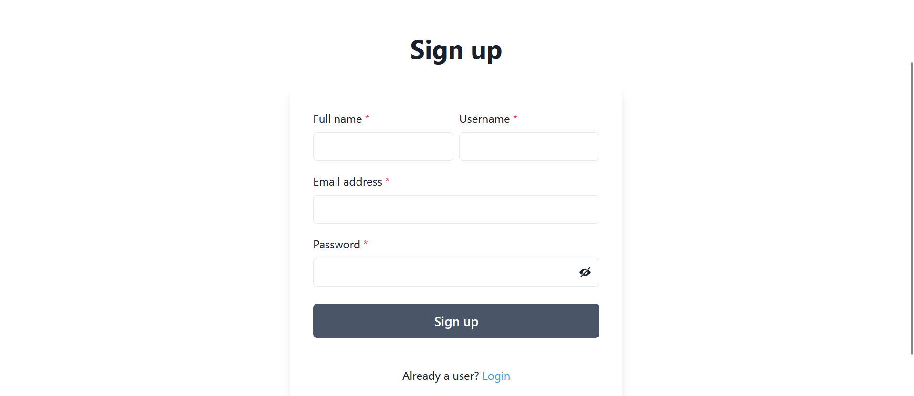
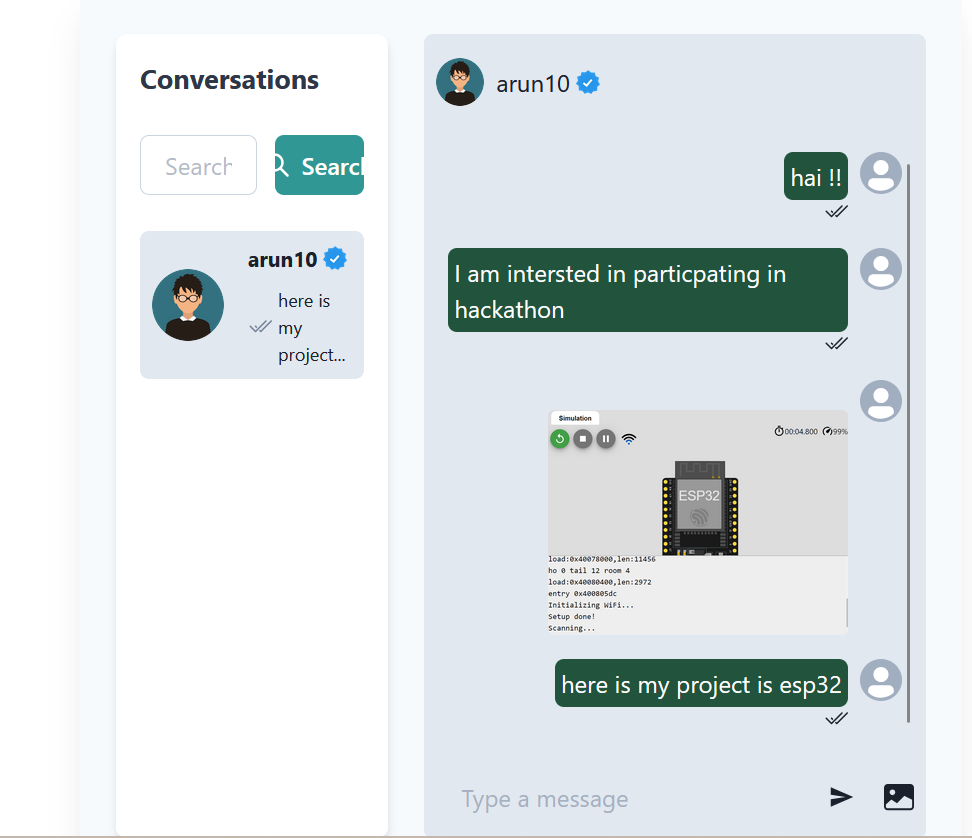
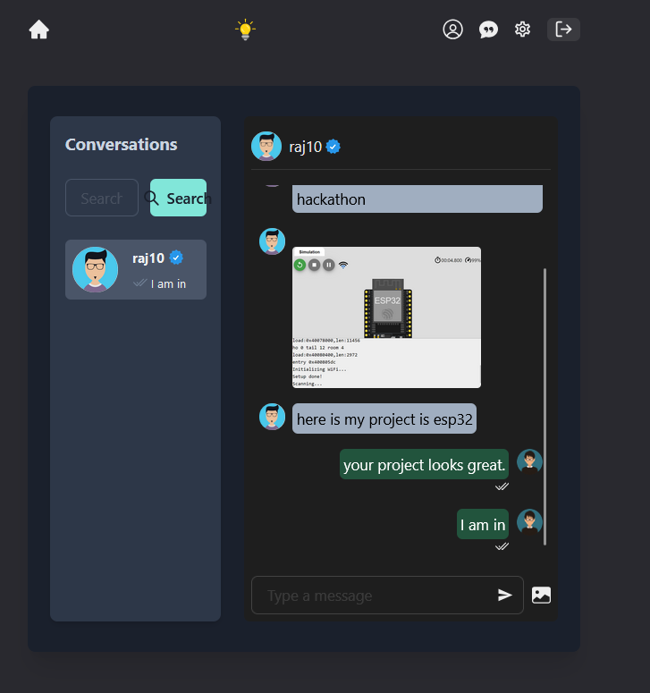
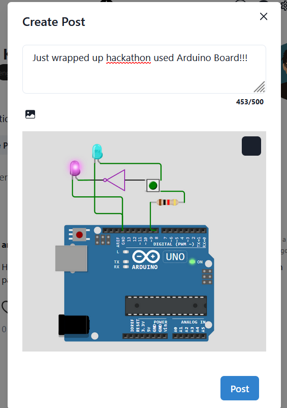
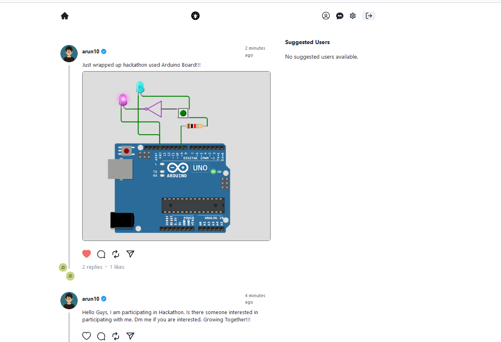
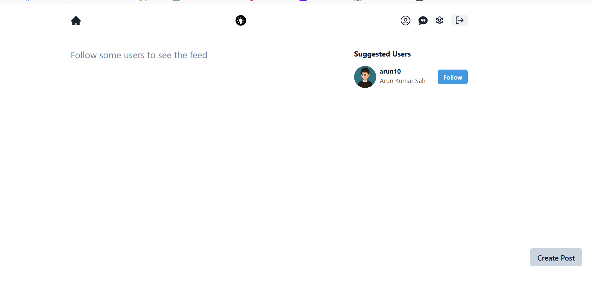
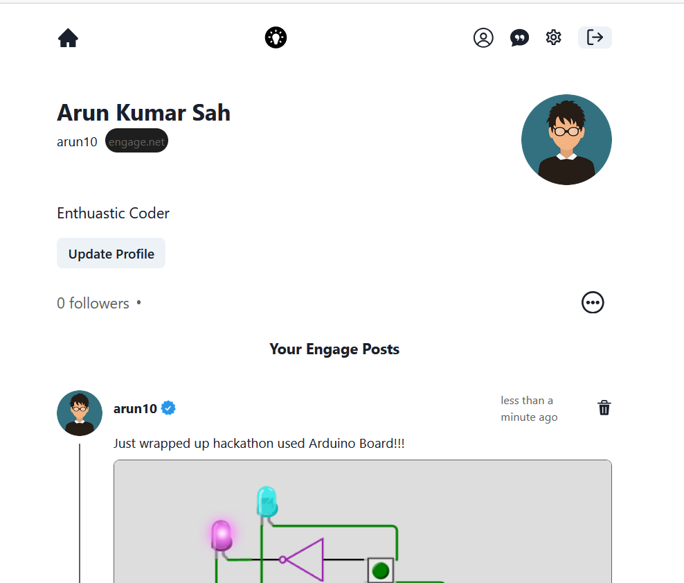
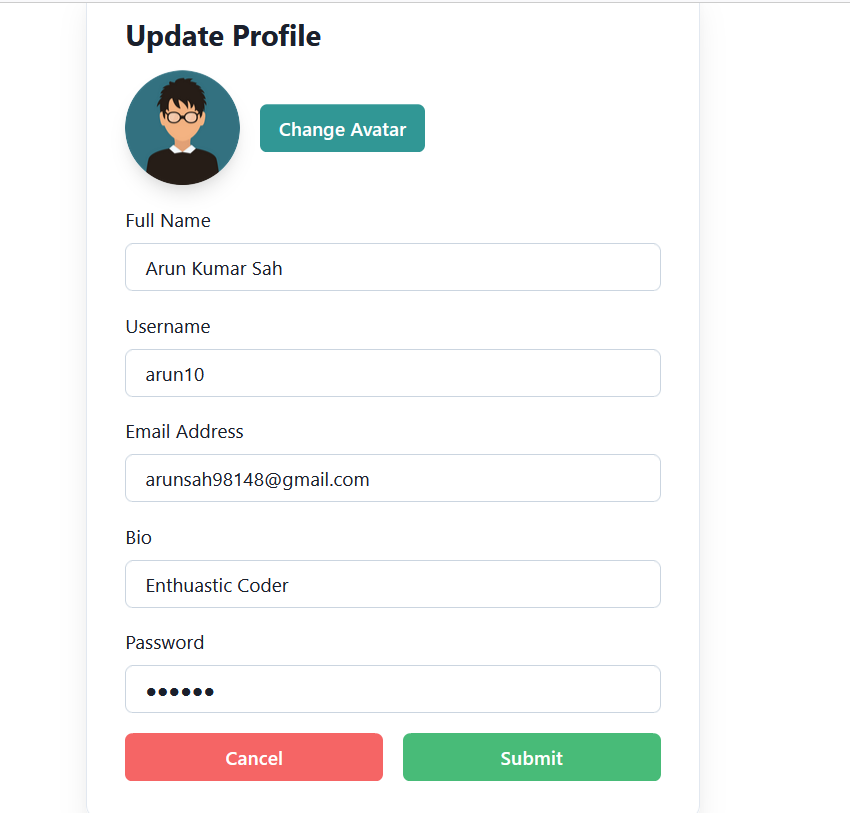

# Engage: Connecting Peoples

**Engage** is a dynamic platform designed to connect college students for innovation, collaboration, and participation in hackathons. It enables students to share achievements, create posts, and interact with peers. With a focus on community building and personal growth, Engage provides a seamless and engaging experience.


## Getting Started

### Clone the Repository

```bash
git clone https://github.com/arunsah10/Engage.git
cd Engage
```

### Setup

1. **Backend Configuration**

   Fill the `.env` file in the `backend` directory with the following environment variables:

   ```env
   PORT=
   MONGO_URI=
   JWT_SECRET=
   CLOUDINARY_CLOUD_NAME=
   CLOUDINARY_API_KEY=
   CLOUDINARY_API_SECRET=
   ```

2. **Frontend Setup**

   Navigate to the `frontend` directory:

   ```bash
   cd frontend
   ```

   Install dependencies and build the frontend:

   ```bash
   npm install
   npm run build
   ```

3. **Backend Setup**

   Navigate to the `backend` directory:

   ```bash
   cd backend
   ```

   Install dependencies and start the server:

   ```bash
   npm install
   npm start
   ```


## Directory Structure

- **backend/**: Contains the server-side code.
- **frontend/**: Contains the client-side code.

### Screenshots

- **Signup Page**: 
- **Chat by One User**: 
- **Chat by Another User**: 
- **Create Post**: 
- **All Feeds from Connections**: 
- **Main Page**: 
- **All Posts Made by the User**: 
- **To Update Profile Details**: 
- **User 1 Profile**: 
- **User 2 Profile**: 


## Feature List

### 🌟 Tech Stack
- **Frontend**: React.js, Chakra UI
- **Backend**: Node.js, Express
- **Database**: MongoDB
- **Real-Time Communication**: Socket.io
- **Cloud Storage**: Cloudinary

### 🎃 Authentication & Authorization
- Secure login and registration with JWT.

### 📝 Create Post
- Easily create and share posts.

### 🗑️ Delete Post
- Remove posts effortlessly.

### 💬 Chat App with Image Support
- Engage in real-time chats with image sharing capabilities.

### 👀 Seen/Unseen Status
- Track the status of your messages.

### ❤️ Like Post
- Show appreciation by liking posts.

### 💬 Comment on Posts
- Engage with posts through comments.

### ❄️ Freeze Your Account
- Temporarily disable your account.

### 🌓 Dark/Light Mode
- Toggle between dark and light themes.

### 📱 Completely Responsive
- Optimized for all devices.


## Unique Features

**Engage** is not just another social platform. It is designed specifically for college students to:
- Foster innovation and collaboration.
- Participate in hackathons and tech events.
- Connect with like-minded individuals and share achievements.
- Create a supportive community for personal and professional growth.


## Future Features

- **Edit Post**: Modify your posts after creation.
- **Unfollow User**: Manage your connections more effectively.
- **Advanced Search**: Search for posts, users, and tags.
- **Notification System**: Stay updated with real-time notifications.
- **User Analytics**: Track engagement and interactions on your posts.


## Author

**Arun Kumar Sah**

## Copyright

© 2024 Arun Kumar Sah. All rights reserved.

## References

- [GitHub Repository](https://github.com/arunsah10/Engage)
- [MERN Stack Documentation](https://mernjs.com)
- [Chakra UI Documentation](https://chakra-ui.com)
- [Cloudinary Documentation](https://cloudinary.com/documentation)
- [Socket.io Documentation](https://socket.io/docs)


Feel free to contribute or raise issues. Happy coding! 🚀

